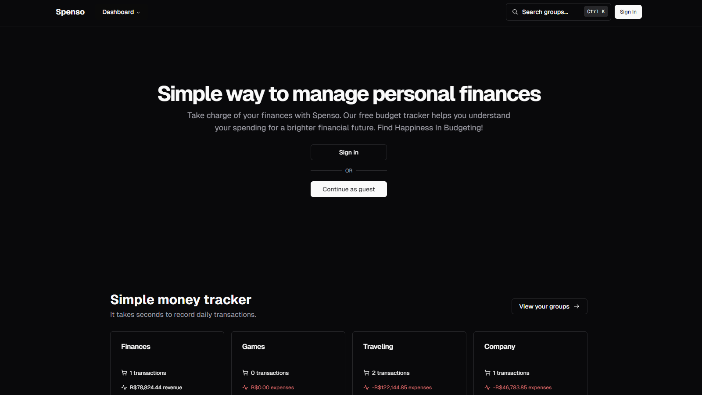

# [Spenso](https://spenso.vercel.app)

Finance web application to track your spending and savings.
Bootstrapped with [`create-next-app`](https://github.com/vercel/next.js/tree/canary/packages/create-next-app).

## Tech Stack

- **Framework:** [Next.js](https://nextjs.org)
- **Styling:** [Tailwind CSS](https://tailwindcss.com)
- **Database:** [Supabase](https://supabase.com)
- **Table:** [Tanstack React Table](https://tanstack.com/table/v8)
- **Form:** [React Hook Form](https://react-hook-form.com)
- **Charts:** [React Chartjs 2](https://react-chartjs-2.js.org)
- **Toaster:** [Sonner](https://sonner.emilkowal.ski)
- **Component Library:** [Radix UI](https://www.radix-ui.com) + [Shadcn UI](https://ui.shadcn.com)

## Features

- Sign in and Log out.
- Create, Read, Update and Delete transactions.
- Save transactions in a database.
- Analyze dashboard charts.

